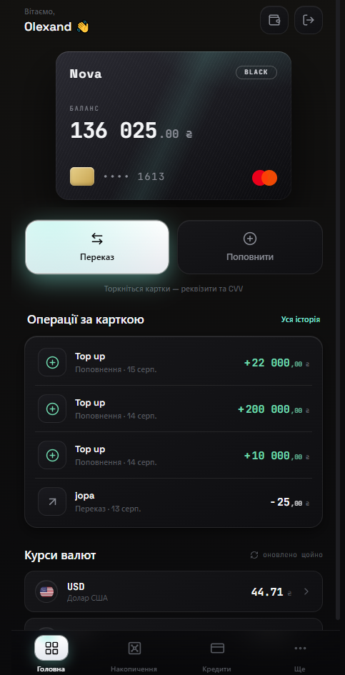
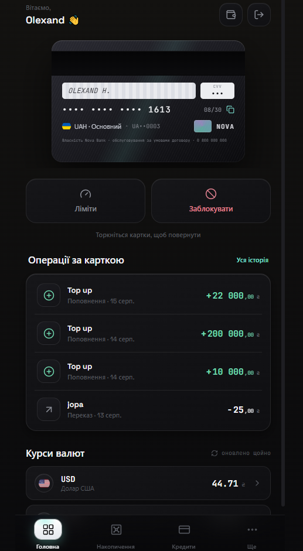
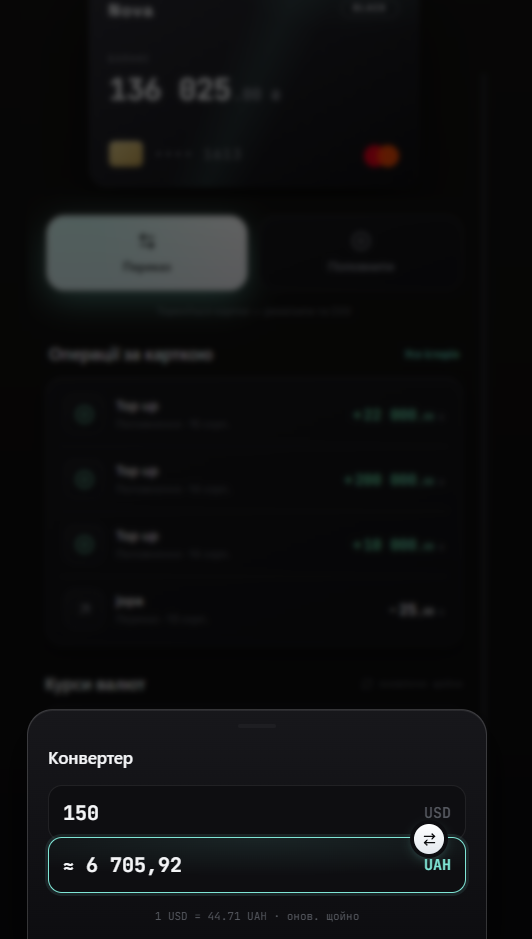
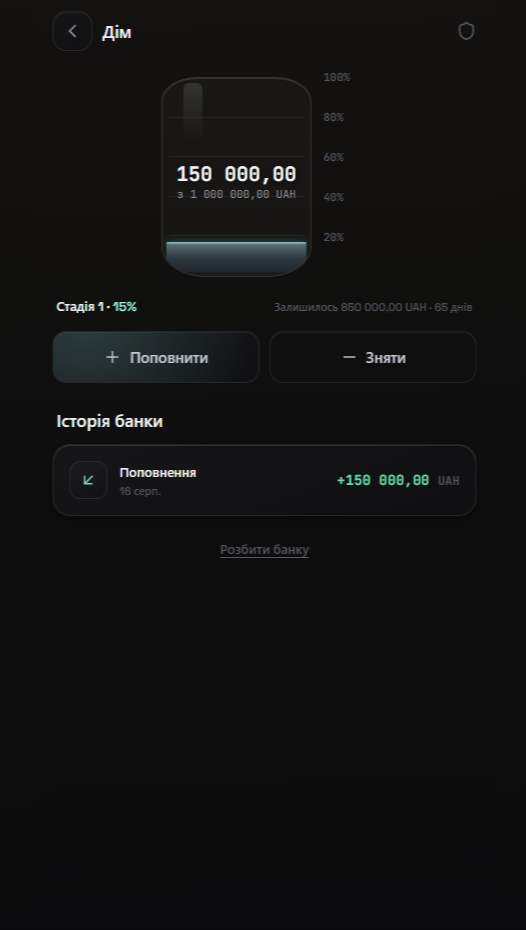
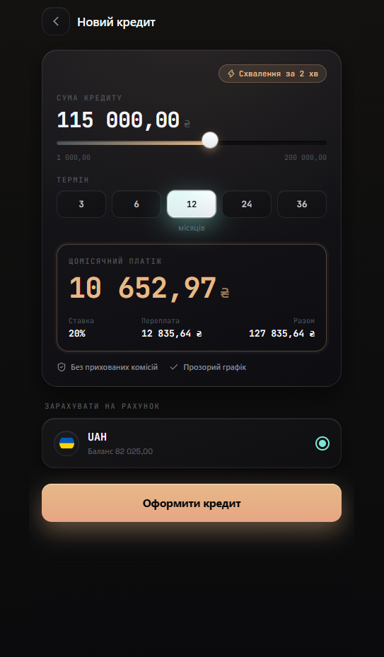
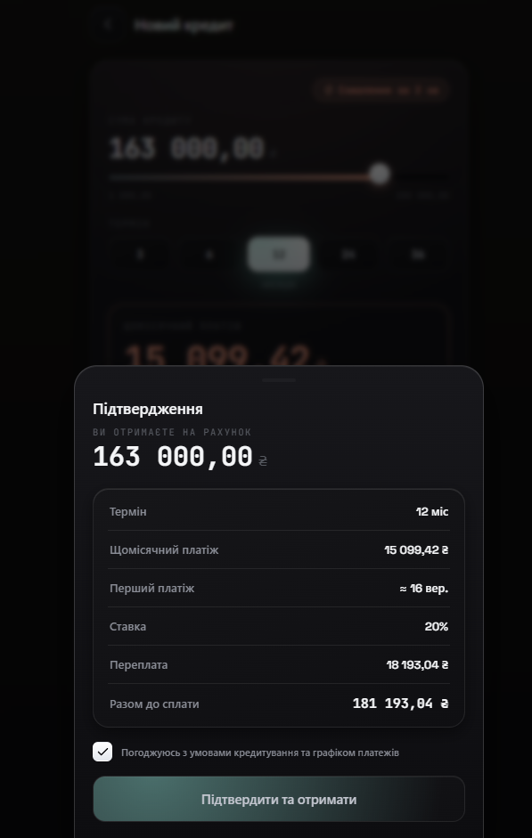
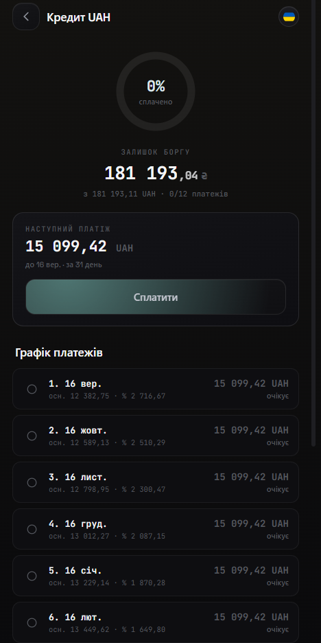
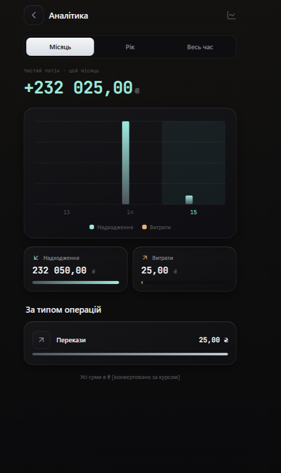
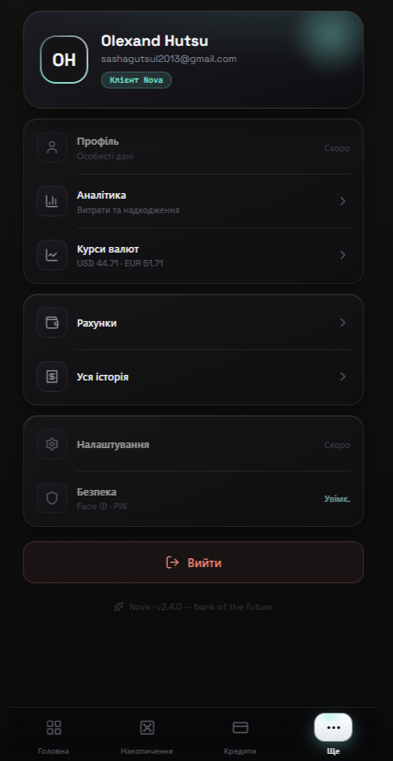

# Nova — Digital Banking Platform

**A full-stack digital bank: multi-currency accounts, premium cards, instant card-to-card transfers, savings jars, annuity loans and spending analytics — built on a .NET 10 Onion-architecture API and a React 19 + TypeScript PWA.**


<p align="center"><em>Nova — «Банк майбутнього». Dark, tech-minimal, iridescent design system across 9+ screens.</em></p>

<p align="center">
  
  
  
  
  
  
  
  
  
</p>

> **Live demo:** coming soon.

---

## Overview

**Nova** is a complete digital-banking product — not a CRUD demo. The backend is an ASP.NET Core Web API
built on a strict Onion/Clean architecture with money-safe primitives (database transactions, idempotency
keys, optimistic concurrency), and the frontend is an installable React PWA with a hand-built dark design
system. Every feature is wired end to end: you register, open accounts in three currencies, issue a
Luhn-valid card, send money card-to-card across currencies at live NBU rates, save into goal jars, take an
annuity loan with a full amortization schedule, and watch it all roll up into analytics.

Built solo as a portfolio project — architecture, API, database, design system and UI.

**Highlights**

`Onion architecture` · `.NET 10` · `JWT + rotating refresh tokens` · `atomic DB transactions`
`idempotency keys` · `optimistic concurrency (RowVersion)` · `IDOR-safe by construction`
`live NBU exchange rates (cached)` · `29 unit tests` · `React 19 PWA` · `Ukrainian UI`

---

## Tech stack

### Backend

| Area | Technology |
| --- | --- |
| Runtime | .NET 10 (`net10.0`), C# with nullable reference types |
| API | ASP.NET Core Web API, attribute-routed controllers, Swagger / Swashbuckle |
| Persistence | Entity Framework Core 10, SQL Server, code-first migrations |
| Auth | JWT Bearer (`AccessTokenMinutes`), rotating refresh tokens, `Role` claim (User / Admin) |
| Password hashing | BCrypt.Net-Next |
| Validation | FluentValidation 12 (auto-registered from the Application assembly) |
| Mapping | AutoMapper 16 (profiles per aggregate) |
| Logging | Serilog — console + daily rolling file, plus request logging |
| Caching / HTTP | `IMemoryCache` + `IHttpClientFactory` (typed `ExchangeRateService`) |
| Errors | `IExceptionHandler` → RFC 7807 `ProblemDetails` |
| Tests | xUnit, Moq, FluentAssertions (29 unit tests) |

### Frontend (`nova-web/`)

| Area | Technology |
| --- | --- |
| Framework | React 19 + TypeScript |
| Build | Vite 8 |
| Routing | React Router 7 |
| State | Zustand (auth + toast stores) |
| Icons / fonts | lucide-react, self-hosted `@fontsource` (Space Grotesk, JetBrains Mono) — no CDN |
| PWA | `vite-plugin-pwa` + Workbox — installable, offline app shell, auto-update SW |
| Styling | Hand-written CSS design tokens (`tokens.css` / `global.css`), dark theme only |
| Lint | oxlint |

---

## Architecture

Nova follows **Onion / Clean architecture**: dependencies point *inwards only*. The domain knows nothing
about EF Core, HTTP or JSON; the application layer talks to abstractions; infrastructure and API are
interchangeable outer rings.

```
                ┌──────────────────────────────────────────────────┐
                │                  BankApp.API                     │
                │  Controllers · JWT setup · CORS · Serilog        │
                │  GlobalExceptionHandler → ProblemDetails         │
                └───────────────────────┬──────────────────────────┘
                                        │ depends on
                ┌───────────────────────▼──────────────────────────┐
                │              BankApp.Infrastructure              │
                │  BankDbContext · Repositories · UnitOfWork        │
                │  BCrypt hasher · JWT generator · Card generator   │
                └───────────────────────┬──────────────────────────┘
                                        │ depends on
                ┌───────────────────────▼──────────────────────────┐
                │              BankApp.Application                 │
                │  Services · DTOs · Validators · AutoMapper        │
                │  Interfaces: IRepository / ISecurity / IService   │
                └───────────────────────┬──────────────────────────┘
                                        │ depends on
                ┌───────────────────────▼──────────────────────────┐
                │                BankApp.Domain                    │
                │  Entities · Enums · zero external dependencies    │
                └──────────────────────────────────────────────────┘

                        BankApp.Tests → Application + Domain
```

**Why:** business rules (transfer limits, annuity math, jar state machine) live in a layer that can be
unit-tested with mocks and zero infrastructure. Swapping SQL Server for another provider, or the REST API
for gRPC, touches only the outer rings.

| Project | Responsibility |
| --- | --- |
| `BankApp.Domain` | Entities (`User`, `Account`, `Card`, `Transaction`, `SavingsJar`, `JarTransaction`, `Loan`, `LoanPayment`, `RefreshToken`) and enums (`Currency`, `CardType`, `Role`, `TransactionType/Status`, `LoanStatus`, `JarTransactionType`). No NuGet packages at all. |
| `BankApp.Application` | Use-case services, DTOs, FluentValidation validators, AutoMapper profiles, `IUnitOfWork` and every repository / security interface. Owns the business rules. |
| `BankApp.Infrastructure` | EF Core `BankDbContext` + fluent model config, repositories, `UnitOfWork` (explicit `BeginTransaction / Commit / Rollback`), BCrypt hasher, JWT generator, Luhn card-number generator, migrations. |
| `BankApp.API` | Thin controllers (`[Authorize]` by default), JWT bearer configuration, CORS, Serilog wiring, Swagger, global exception handling, auto-migrate on startup. |
| `BankApp.Tests` | xUnit + Moq + FluentAssertions unit tests over the application services. |

---

## Features

### Authentication & session

Register / login with BCrypt-hashed passwords, JWT access tokens carrying `NameIdentifier`, `Name`,
`Email` and `Role` claims, and **rotating refresh tokens**: every `/api/auth/refresh` revokes the presented
token and issues a brand-new pair. The client refreshes **silently** — a single in-flight refresh promise
de-duplicates parallel 401s, replays the original requests, and only falls back to the login screen when
the refresh token itself is dead.

### Home & accounts



Multi-currency accounts in **UAH / USD / EUR**, each with its own balance, cards and jars. The dashboard
leads with the card carousel, quick actions (transfer / top-up), recent card operations and a live rates
widget.

*Home — card-led dashboard with quick actions, card history and live FX rates.*

<br clear="right">

### Cards



Three tiers — **White / Black / Platinum** — with distinct skins. Numbers are generated **Luhn-valid**
(16 digits, `4` prefix, computed check digit) and re-rolled until unique against a unique DB index. Tap the
card to flip it: holder, masked number, expiry and **CVV on demand** (a separate authorized endpoint, never
shipped with the card list). Cards can be **blocked** and given a **daily spending limit** that transfers
check against the amount already spent today.

*Card back — magstripe, holder, expiry and on-demand CVV; limits and block actions below.*

<br clear="right">

### Transfers

Two flavours — by account id and **by card number** — plus top-up. Every transfer:

1. verifies the source card belongs to the caller and is active,
2. checks funds and the card's daily limit against today's spend,
3. converts the amount if the currencies differ,
4. writes debit, credit and the transaction row **inside one database transaction**,
5. is protected by an **idempotency key** with a unique index — a retried request can never double-spend.

### Currency exchange



Live rates from the **National Bank of Ukraine** (`bank.gov.ua`), fetched through a typed `HttpClient` and
cached per currency for **1 hour** so the API stays fast and never hammers the upstream. The same service
powers cross-currency transfers, the rates widget and analytics normalisation.

*Quick converter — USD → UAH at the live NBU rate, with cache age shown.*

<br clear="right">

### Savings jars



Goal-based jars bound to an account: name, icon, target amount, optional target date. Deposit and withdraw
move real money between the account and the jar under a DB transaction, each operation carrying its own
idempotency key and landing in the jar's history. Closing a jar ("розбити банку") returns the balance to
the account.

*Savings jar "Дім" — liquid fill animation, progress stage, remaining amount and days, jar history.*

<br clear="right">

### Loans



A full annuity-loan flow at a fixed **20 % APR**. The calculator endpoint returns monthly payment, total
interest and total repayable for any principal/term before anything is committed.

*New loan — amount slider, term selector, live monthly payment, overpayment and total.*

<br clear="right">



Confirmation shows the exact terms the server computed — term, monthly payment, first payment date, rate,
overpayment and total — before the principal is credited.

*Confirmation sheet — the full cost of credit, agreed explicitly before disbursement.*

<br clear="right">



Taking the loan generates the **entire amortization schedule up front**: every installment with its due
date, principal part and interest part (with the final installment closing the balance exactly). Paying
debits the account, marks the installment paid, advances `NextPaymentDate` and flips the loan to `Paid`
when the last one clears. Installments past their due date are surfaced as overdue.

*Loan detail — progress ring, remaining debt, next payment and the full month-by-month schedule.*

<br clear="right">

### Analytics



Spending vs income over **month / year / all time**, with a grouped bar chart, net flow, and a breakdown by
operation type. Amounts in USD and EUR are normalised to UAH at live rates, so a multi-currency portfolio
still rolls up into one honest number.

*Analytics — received vs spent per period, net flow and per-type breakdown.*

<br clear="right">

### More hub



Identity card, entry points to analytics, rates, accounts and full history, plus session controls.

*"Ще" — profile identity, secondary navigation and logout.*

<br clear="right">

---

## Screenshots

| | |
| --- | --- |
| <br>**Home dashboard** | <br>**Card back · CVV on demand** |
| <br>**Currency converter** | <br>**Savings jar** |
| <br>**Loan calculator** | <br>**Loan confirmation** |
| <br>**Amortization schedule** | <br>**Analytics** |
| <br>**More hub** | <br>**Design system showcase** |

---

## Engineering highlights

Things worth reviewing if you're evaluating this codebase:

- **Atomic money movement.** `IUnitOfWork` exposes explicit `BeginTransactionAsync / CommitTransactionAsync /
  RollbackTransactionAsync`. Every balance-changing operation — transfer, top-up, jar deposit/withdraw, loan
  disbursement, loan payment — mutates both sides *and* writes its ledger row inside one transaction, with
  rollback on any exception.
- **Idempotency keys.** `Transaction.IdempotencyKey` and `JarTransaction.IdempotencyKey` both carry a
  **unique index**, and services reject duplicates before doing any work. The client generates one GUID per
  logical operation and reuses it on retry — a double-tapped "Send" cannot move money twice.
- **Optimistic concurrency.** `Account.RowVersion` is configured with `IsRowVersion()`, so two concurrent
  writes to the same balance surface as a concurrency conflict instead of a lost update.
- **IDOR protection by construction.** Ownership is a *query* concern, not an afterthought: repositories
  expose `GetMyAccountByIdAsync(userId, id)`, `GetCardByIdAsync(userId, id)`, `GetMyLoanByIdAsync(userId, id)`
  and friends. There is no code path that loads a resource by id alone and checks ownership later.
- **Global exception handling.** A single `IExceptionHandler` maps domain exceptions to status codes
  (`KeyNotFoundException` → 404, `InvalidOperationException` → 400, `UnauthorizedAccessException` → 401) and
  returns **RFC 7807 `ProblemDetails`**. Unexpected exceptions are logged in full but returned as a generic
  message — no internals leak. The frontend reads `detail` / `errors` back out of the same envelope.
- **29 unit tests** (xUnit + Moq + FluentAssertions) across account, card, transaction, jar, loan, analytics
  and exchange-rate services — covering the money paths: insufficient funds, blocked cards, daily-limit
  breaches, duplicate idempotency keys, annuity math and rate caching.
- **Cached external integration.** NBU rates are fetched via a typed `HttpClient` and memoised per currency
  for an hour; consumers (transfers, analytics, rates widget) never care where the number came from.
- **Refresh-token rotation.** Refresh tokens are 64 bytes of CSPRNG entropy, stored with a unique index,
  single-use (revoked on refresh), revocable on logout, and paired with a short-lived access token.
- **PWA.** Installable, standalone, auto-updating service worker with a pre-cached app shell — and an
  explicit `NetworkOnly` rule for `/api`, because banking data must never be served stale from a cache.

---

## Getting started

### Prerequisites

- [.NET SDK 10.0+](https://dotnet.microsoft.com/download)
- [Node.js 20+](https://nodejs.org/)
- SQL Server (LocalDB, Express or full) — any instance you can point a connection string at
- `dotnet-ef` tools: `dotnet tool install --global dotnet-ef`

### 1. Backend

Set your connection string and JWT settings in `BankApp.API/appsettings.json` (or, preferably, user secrets):

```json
{
  "ConnectionStrings": {
    "DefaultConnection": "Server=localhost;Database=BankAppDb;Trusted_Connection=True;TrustServerCertificate=True;"
  },
  "Jwt": {
    "Key": "replace-with-a-32-char-minimum-secret",
    "Issuer": "NovaBank",
    "Audience": "NovaBankClient",
    "AccessTokenMinutes": 30,
    "RefreshTokenDays": 30
  }
}
```

Apply the migrations:

```bash
dotnet ef database update --project BankApp.Infrastructure --startup-project BankApp.API
```

Run the API:

```bash
dotnet run --project BankApp.API
```

The API listens on `http://localhost:5203` and, in Development, serves Swagger UI at `/swagger`.
Pending migrations are also applied automatically on startup.

### 2. Frontend

```bash
cd nova-web
npm install
npm run dev
```

Configure the API base URL in `nova-web/.env` (a `.env.example` is provided):

```bash
VITE_API_BASE_URL=http://localhost:5203
```

The dev server is pinned to **`http://localhost:5173`** — that exact origin is what the backend's CORS
policy allows, so don't change the port without updating `Program.cs`.

Production build:

```bash
npm run build      # → dist/ (tsc + vite + service worker)
npm run preview
```

### 3. Tests

```bash
dotnet test
```

---

## API overview

All routes are prefixed with `/api`. Everything except `register` / `login` / `refresh` requires
`Authorization: Bearer <access-token>`; every resource route is scoped to the authenticated user.

| Group | Endpoint | Description |
| --- | --- | --- |
| **Auth** | `POST /auth/register` | Create a user (BCrypt hash) and return the token pair |
| | `POST /auth/login` | Authenticate and return the token pair |
| | `POST /auth/refresh` | Rotate the refresh token, issue a new access token |
| | `POST /auth/logout` | Revoke the presented refresh token |
| **Accounts** | `POST /accounts` | Open an account in UAH / USD / EUR |
| | `GET /accounts` | List my accounts |
| | `GET /accounts/{id}` | Account detail (ownership-scoped) |
| **Cards** | `POST /cards` | Issue a card (White / Black / Platinum, Luhn-valid number) |
| | `GET /cards/{id}` | Card detail |
| | `PATCH /cards/{id}/block` | Block a card |
| | `PATCH /cards/{id}/limit` | Set / clear the daily spending limit |
| | `GET /cards/{id}/cvv` | Reveal CVV on demand |
| | `GET /cards/{id}/spent-today` | Amount spent today (limit progress) |
| | `GET /cards/currency-by-number/{cardNumber}` | Resolve a recipient card's currency |
| **Transactions** | `POST /transactions/transfer` | Transfer to an account id (idempotent, atomic) |
| | `POST /transactions/transfer-by-card` | Transfer by card number, cross-currency at NBU rates |
| | `POST /transactions/topup` | Top up a card's account |
| | `GET /transactions` | Paged history |
| | `GET /transactions/{id}` | Transaction detail |
| **Jars** | `POST /jars` · `GET /jars` · `GET /jars/{id}` | Create / list / read savings jars |
| | `POST /jars/{id}/deposit` · `POST /jars/{id}/withdraw` | Move money in and out (idempotent) |
| | `POST /jars/{id}/close` | Close the jar and return funds |
| | `GET /jars/{id}/history` | Jar operation history |
| **Loans** | `POST /loans/calculate` | Annuity quote — monthly payment, interest, total |
| | `POST /loans` | Take a loan; credits the account, generates the schedule |
| | `GET /loans` · `GET /loans/{id}` | List / read loans |
| | `GET /loans/{id}/schedule` | Full amortization schedule |
| | `POST /loans/{id}/pay` | Pay the next installment |
| **Rates** | `GET /rates/{currency}` | Live NBU rate to UAH (1h cached) |
| **Analytics** | `GET /analytics?period=month\|year\|all` | Spent / received / net, chart series, per-type breakdown |

---

## Engineering decisions & what I learned

- **Money needs more than a `decimal`.** The first version of the transfer endpoint updated two balances and
  saved. That's a lost-update and a double-spend waiting to happen. Rebuilding it around an explicit unit of
  work, a unique idempotency key and a `RowVersion` token was the single most valuable change in the project —
  and it's the design conversation I'd want to have in an interview.
- **Onion pays off at test time.** Because services depend only on interfaces, all 29 tests run with mocks and
  no database, in under a second. Enforcing "the domain references nothing" kept EF Core attributes out of the
  entities and pushed all persistence detail into fluent configuration.
- **Authorisation belongs in the query.** Loading an entity and *then* comparing `entity.UserId` is one missed
  `if` away from an IDOR. Making every repository method take `userId` means the insecure version simply
  doesn't exist in the API surface.
- **Third-party APIs are a dependency, not a given.** NBU rates sit behind an interface and a memory cache, so
  the rest of the system doesn't know or care about their latency or availability.
- **Silent refresh is a concurrency problem.** Ten screens firing requests at once produce ten simultaneous
  401s. Collapsing them onto one in-flight refresh promise — and replaying the originals afterwards — was the
  difference between a token-rotation "feature" and one that actually works under load.
- **Designing the UI taught me the API.** Building the frontend surfaced everything the backend was missing:
  `spent-today` for limit progress, `currency-by-number` for the transfer sheet, a `calculate` endpoint so the
  loan slider never lies about the payment. Full-stack ownership makes both halves better.

---

## License

Released under the MIT License.

<p align="center"><sub>Nova · bank of the future — designed & built by Olexand Hutsul</sub></p>
